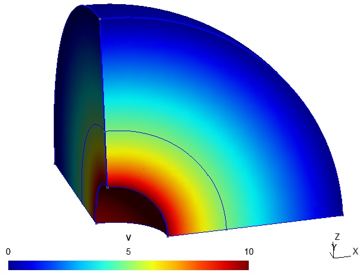
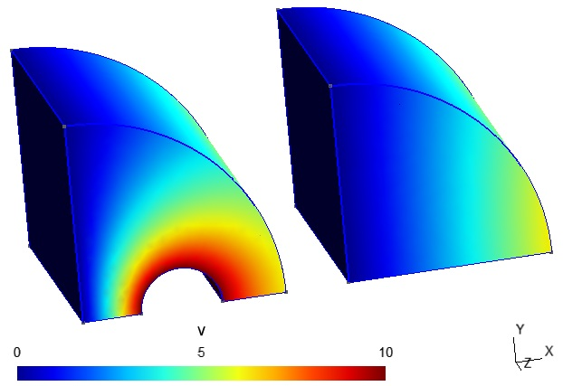
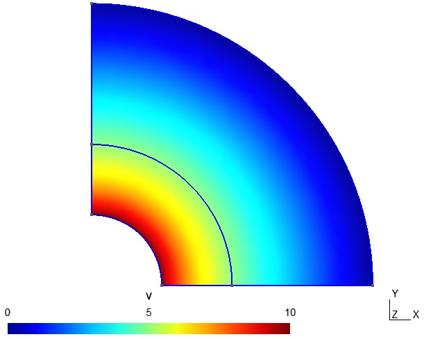
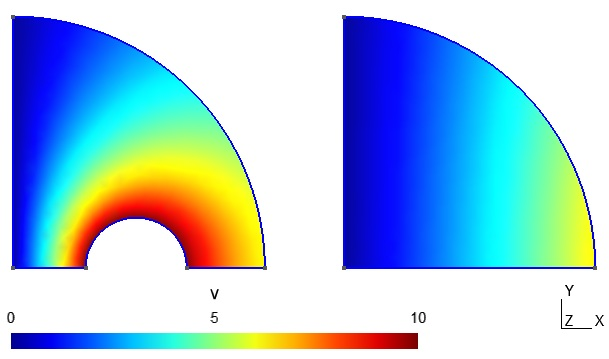

# Shell and Kelvin transformation benchmarking

This directory contains examples for studying the Kelvin (inversion) and shell transformations in [GetDP](https://getdp.info/). A version _greater_ than 3.5.0 of GepDP is required (or a development version, until such a version is released). The examples cover the following cases on Form0 (scalar potential) function spaces:

* [3D-Spherical](#3Dsperical)

* [3D-Cylindrical](#3Dcylindrical)

* [2D-Axisymmetric](#2Daxisymmetric)

* [2D-Planar](#2Dplanar)

More specifically, the electrostatic potential is simulated for a pair of perfectly conducting parallel cylindrical conductors (called wirepair) or for a single perfectly conducting sphere. Given the symmetry that is exploited, only one of the two wires is visible in the geometric model.

The electric field energy in the entire unbounded space is computed in both geometries, from which the capacitance can then be established. For the cylindrical case, it is the capacitance between the two wires, and in the spherical case, it is the capacitance with respect to infinity (i.e. an outer shell at infinity).

## General remarks

### Implementation note

Support for the Kelvin transformation was added in the development version of GetDP in early march 2025, and requires a version of GetDP _greater_ than 3.5.0 (or a development version until such a version is released).

### Meshing

The meshing is kept as simple as possible and is generally uniform. In the interior region it is identical in both the shell and Kelvin cases. In the exterior region, the mesh becomes coarser near the outer boundary in the shell case, while it is kept uniform in the Kelvin case. This is done in order to keep the number of degrees of freedom generally comparable between both cases. The entire mesh size is also automatically doubled for second order simulations, when compared to first order simulations.

### Number of integration points

An option is provided in each simulation to study the effect of the number of integration points used in the Integration object in the models' code. 

When the "Min num of integration pts" option is checked, the theoretical minimum number of points is used. For first order simulations, triangles and tetrahedra can be properly integrated with a single point, while for second order simulations, three points are needed for triangles and four points are needed for tetrahedra. Interestingly, the results below show that the choice of points can have a non-negligible effect in some cases.
 
When the "Min num of integration pts" option is not checked, the numbers of points correspond to those given in the `Lib_Elasticity_u.pro` template that is bundled with GetDP.

### Second order elements

When the "2nd order elements" option is checked, both second order geometrical elements are used, as well as second order interpolation basis functions. The only visible effect of this parameter in the models is in the `.geo` files, since for Form0 spaces the `BF_Node_2E` basis functions are automatically added in GetDP (and thus are not explicitly visible in the `.pro` files).

## Test cases

### 3D Spherical

3D model of the capacitance of a single sphere (with respect to infinity), with the shell (pictured) and Kelvin transformations. 

Relative difference in the capacitance of the simulation, when compared to the analytical calculation:

| Order:	| Transform:	| Num int pts:	| 			| Dofs:	|
| ---- | ---- | ---- | ---- | ---- |
|			|  				| Minimum		| Template	| 		|
| First		| Kelvin		| -0.282%		| 0.128%	| 59244	|
| First		| Shell			| 0.454%		| 2.50%		| 83545	|
| Second	| Kelvin		| -0.608%		| -0.263%	| 65817	|
| Second	| Shell			| 0.000752%		| 0.000844%	| 92437	|

Comments: First order Kelvin seems quite good; however, for second order simulations, Kelvin is not as good as first order and shell is the preferred transformation.

### 3D Cylindrical

3D model of the capacitance of a pair of parallel wires, with the Kelvin (pictured) and shell transformations.

Relative difference in the capacitance of the simulation, when compared to the analytical calculation:

| Order:	| Transform:	| Num int pts:	| 			| Dofs:	|
| ---- | ---- | ---- | ---- | ---- |
|			|  				| Minimum		| Template	| 		|
| First		| Kelvin		| 0.0995%		| 0.0995%	| 88324	|
| First		| Shell			| 0.894%		| 1.26%		| 86094	|
| Second	| Kelvin		| 0.00248%		| 0.00238%	| 94351	|
| Second	| Shell			| 0.00290%		| 0.00345%	| 94052	|

Comments: First order Kelvin seems noticeably more accurate than shell, but both shell and Kelvin are quite comparable for second order simulations.

### 2D Axisymmetric

2D model of the capacitance of a single sphere (with respect to infinity), with the shell (pictured) and Kelvin transformations.

Relative difference in the capacitance of the simulation, when compared to the analytical calculation:

| Order:	| Transform:	| Num int pts:	| 			| Dofs:	|
| ---- | ---- | ---- | ---- | ---- |
|			|  				| Minimum		| Template	| 		|
| First		| Kelvin		| 66.1%			| 66.1%		| 3023	|
| First		| Shell			| 0.223%		| 1.36%		| 3601	|
| Second	| Kelvin		| 66.0%			| 66.0%		| 3178	|
| Second	| Shell			| 0.0000965%	| 0.000465%	| 3802	|

Comments: The shell transformation is clearly preferable here and something likely needs to be improved with the axisymmetric Kelvin transformation.

### 2D Planar

2D model of the capacitance of a pair of parallel wires, with the Kelvin (pictured) and shell transformations.

Relative difference in the capacitance of the simulation, when compared to the analytical calculation: 

| Order:	| Transform:	| Num int pts:	| 			| Dofs:	|
| ---- | ---- | ---- | ---- | ---- |
|			|  				| Minimum		| Template	| 		|
| First		| Kelvin		| 0.0000149%	| 0.0000149%| 2851	|
| First		| Shell			| 0.0125%		| 0.0279%	| 3457	|
| Second	| Kelvin		| 0.000619%		| 0.000545%	| 2971	|
| Second	| Shell			| 0.000630%		| 0.000565%	| 3647	|

Comments: the first order Kelvin simulation is actually more accurate than the second order simulation, which is unexpected and perhaps just circumstantial.

# Conclusion

From the above results, the following observations can be made:

* The Kelvin transformation works quite well in the 3D-Cylindrical and 2D-Planar cases: it seems much better than the shell transformation in first order simulations, and is comparable to the shell transformation in second order simulations.

* The Kelvin transformation is more problematic in the 3D-Spherical and 2D-Axisymmetric cases: the only instance where it performs favorably is the first order 3D-Spherical case, while for the 2D-Axisymmetric case, something seems wrong and further investigation is required.

* The number of integration points also has an effect in certain scenarios: choosing the theoretical minimum number of points is sometimes advantageous (sometimes by a wide margin), while in other cases the values from the template show a slight improvement.

It should be emphasized that these results and conclusions are based on single simulations with fixed parameters, and that the results could potentially behave a bit differently as the different parameters (model dimensions, meshing, etc.) are varied. It is left to the reader to explore this further.

If any errors are observed in the above results and/or the simulation files, please open a github issue.
