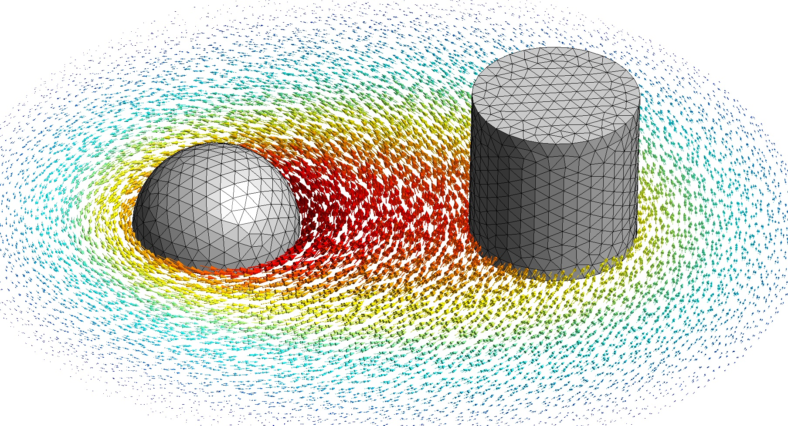

# Energy And Momentum

This folder contains the [ONELAB](https://onelab.info/) simulation code related to the manuscript titled "Validating Open Boundary Simulations in Electrostatics and Magnetostatics". 

To run the simulations, open `main.pro` in Gmsh, select the problem type, and press the Run button. Other parameters are set directly in the simulation files, namely in `sphere_common.pro` and `main.pro`.

Subfolders contain simulations using other FEM software.

