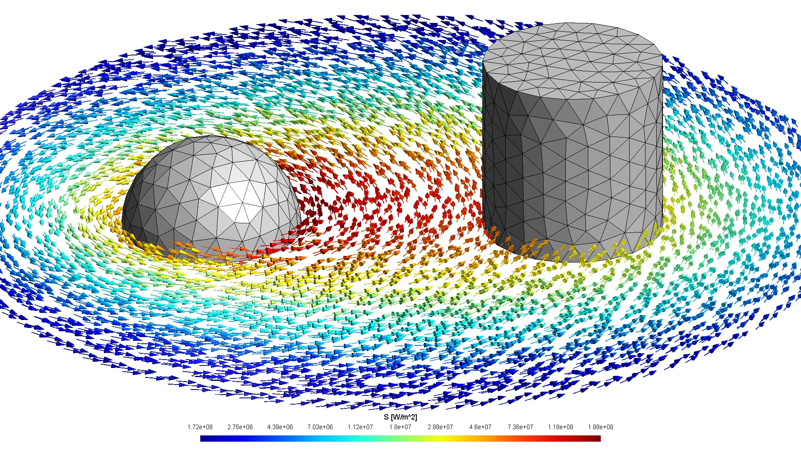

# Energy, Force, Torque and Momentum

This folder contains [ONELAB](https://onelab.info/) simulation code for benchmarking open boundary electrostatic and magnetostatic simulations. The main quantities that are calculated are the energy (one or two spheres), force and torque (two spheres), and the electromagnetic momentum (one sphere).

To run the simulations, open `main.pro` in Gmsh, select the problem type, and press the Run button. Other parameters are set directly in the simulation files, namely in `main_common.pro` and `main.pro`.

