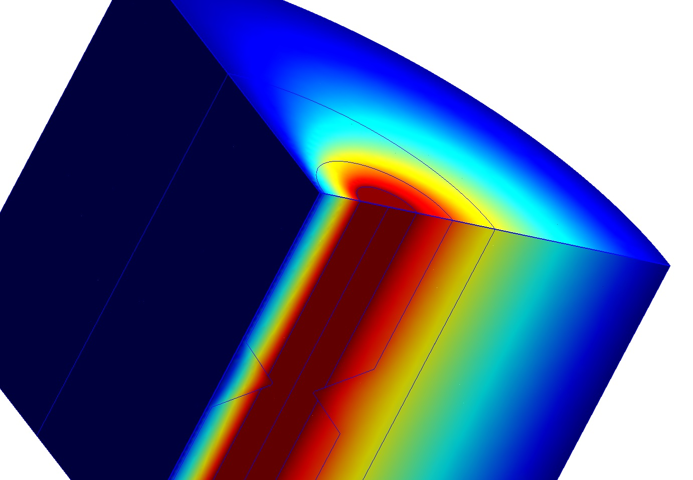

# Wirepair RLC

This folder contains the [ONELAB](https://onelab.info/) simulation code that can be used to compute the DC (or low frequency) [RLC parameters of a two wire line using a 3D FEM simulation](https://arxiv.org/abs/2601.09829).

To run the simulation, open `wirepair.pro` in Gmsh and press the Run button.

The 2D simulation code is in the "2D" subfolder, while the IABC subfolder contains a 3D model using a 4th order Improvised Asymptotic Boundary Condition for the exterior region instead of the shell transformation.

